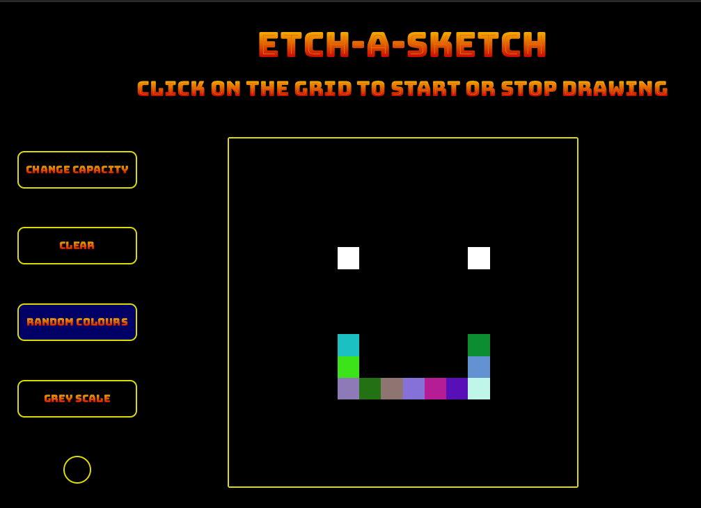

# Etch-a-Sketch



## Summary

**Hosted:** [Etch-a-Sketch Page](https://blurryq.github.io/etch-a-sketch/)

I’ve created a digital Etch-a-Sketch game with added colorful (or grayscale) functionality to bring an interactive twist to a classic concept. Users can click on the grid to start and stop drawing, making it easy to sketch designs like smiley faces. The flexibility to toggle between grayscale and random colors adds a fun, dynamic element to the experience.

## Features

This Etch-a-Sketch project showcases my knowledge of HTML, CSS, and JavaScript and includes:

- **Customizable Grid**: A flexible grid where users can specify the number of squares per side, up to a maximum of 100, allowing for detailed or broader sketches.
- **Drawing Modes**: Options to toggle between grayscale and random colors when drawing on the grid, providing creative options for users.
- **Drawing Toggle**: Click functionality that allows users to start or stop drawing, adding convenience for more precise sketching.
- **Clear Button**: A simple button to clear the grid, letting users easily reset the Etch-a-Sketch canvas.
- **Drawing Indicator Light**: A visual indicator showing whether the drawing mode is active, enhancing the user interface with clarity and functionality.

## Setup

To get started with this project, follow the steps below:

### 1. Fork the Repository

First, you need to fork this repository to your GitHub account by clicking the "Fork" button near the top right of this page. If you are unfamiliar with this process, please follow this GitHub [guide](https://docs.github.com/en/pull-requests/collaborating-with-pull-requests/working-with-forks/fork-a-repo).

### 2. Clone the Repository

Next, clone the repository to your local machine using the following command. Make sure to replace `your-username` with your GitHub username:

```
git clone https://github.com/your-username/etch-a-sketch
```

### 3. Running the File

Once cloned, navigate to your project folder, locate the HTML file, and double-click it. This should open the file in your default browser.

Alternatively, if you're using Visual Studio Code, you can install the "Live Server" extension and use it to launch the project by right-clicking on the HTML file and selecting **Open with Live Server**.

### 4. Have Fun

Draw away to your heart's content, or play with the code to make it better—or break it better!

## Challenges

This project required me to tackle several interesting challenges, helping me develop more advanced skills in JavaScript and CSS. Key challenges included:

- **Dynamic Grid Creation**: Generating a responsive grid based on user input required careful calculations for square sizes and a strong understanding of DOM manipulation.
- **Grid Reset Logic**: Ensuring the grid could be cleared and redrawn seamlessly was crucial, as it had to update while preserving chosen configurations like grid size.
- **Multi-Mode Fill Logic**: Implementing different fill modes (grayscale and random colors) required managing conditional styling changes, especially to transition between drawing modes smoothly.
- **Visual Feedback for Drawing Status**: Creating a toggle for drawing mode and an indicator light presented some design and functionality challenges to keep the UI intuitive.
- **Color Transitions in Grayscale Mode**: Achieving gradual transitions through shades of gray called for strategic CSS class management and fine-tuning event handling for a smooth user experience.